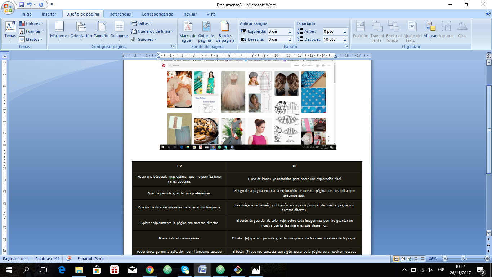

# UX-UI
## Explicamos las partes conforman el UX y qué partes el UI de la pagina pinterest.

| UI                                                         |                            UX                                         |   
|:-------------|:-------------|
|El uso de iconos  conocidos para una exploración fácil.     | Hacer una búsqueda mas optima, que me permita tener varias opciones.|
|El logo de la página en toda la exploración  nuestra pagina.|  Que me permita guardar mis preferencias.|
|||
|Las imágenes  parte principal de página,accesos directos.   | Que me de diversas imágenes basadas enmi búsqueda.|
|El botón (+) nos permite guardar ideas creativas de la pág. | Explorar rápidamente la pág con accesos directos.|
|||
|El botón (?) que nos contacta con algún asesor de la página.| Buena calidad de imágenes.|
|||
|Poder descargarme la aplicación permitiéndome acceder desde cualquier móvil.|

